# CarRace

**CarRace**  is a 3D racing game built on a custom C++ game engine, created as an engineering project to explore game engine development from the ground up.
The project focuses on physics–graphics integration, combining NVIDIA PhysX for realistic vehicle simulation with a custom OpenGL renderer.

The game supports **single-player** and **local two-player split-screen** modes.

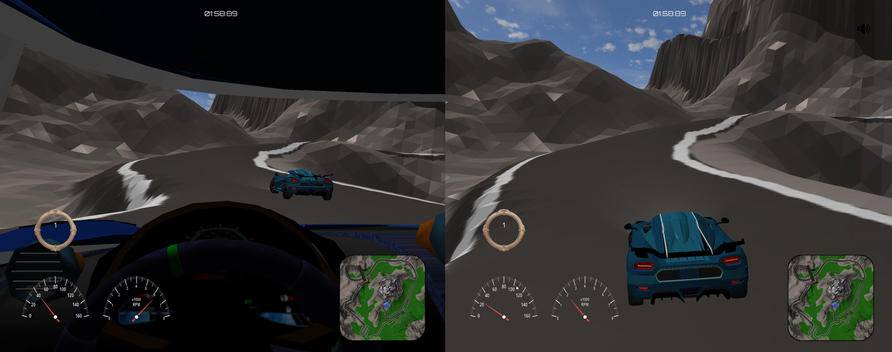

---

## Table of Contents

- [Features](#features)
- [Technologies Used](#technologies-used)
- [Build Instructions](#build-instructions)
- [Game Instructions](#game-instructions)
- [Demo](#demo)

---

## Features

- Custom terrain with integrated road system  
- Fully interactive map objects:
  - Trees, buildings, bridges
  - Physics-enabled barriers and obstacles
- Advanced car simulation:
  - Headlights and brake lights
  - Steering wheel and wheel rotation
  - Side mirrors
- Multiple camera systems:
  - Intro cinematic camera with interpolated paths
  - First-person camera
  - Three third-person follow cameras
- Realistic driving mechanics:
  - Manual gear shifting
  - Surface-dependent friction (grass vs. asphalt)
  - Automatic and manual car reset to track
- User Interface:
  - Speedometer, RPM gauge, gear indicator
  - Lap time and countdown at race start
  - Mini-map with car positions
- Audio system:
  - Engine sound
  - Tire slip
  - Collisions
  - Falling off the track
- Visual effects:
  - Day / night cycle
  - Fog
- Local split-screen multiplayer
- Dedicated **Game Launcher** project for configuration and settings
- Flexible input system:
  - Xbox controller
  - PlayStation 5 controller
  - Thrustmaster TMX wheel and pedals

---

## Technologies Used

- **C++** - Core language for the game engine and gameplay logic  
- **OpenGL** - Graphics API  
- **NVIDIA PhysX** - Physics simulation  
- **miniaudio** - Audio playback and sound management  
- **Assimp** - 3D model loading  
- **GLFW** - Window creation and input handling  
- **GLAD** - OpenGL function loader  
- **GLM** - Mathematics library for vectors, matrices, and transformations  
- **ImGui** - Debug tools and in-game UI windows  
- **HIDAPI / XInput** - Input handling for controllers and steering wheels  
- **RapidJSON** - JSON parsing and configuration loading  
- **Google Test** - Unit testing framework  

---

## Build Instructions

```bash
git clone https://github.com/pietraldo/CarRace.git
cd CarRace
git submodule init
git submodule update
cmake -S . -B build
cmake --build build
```
## Game Instructions

To start the game, run `CarRace/CarRaceLauncher.exe`, select the number of players and basic settings such as **day/night mode**, then click **Play**.

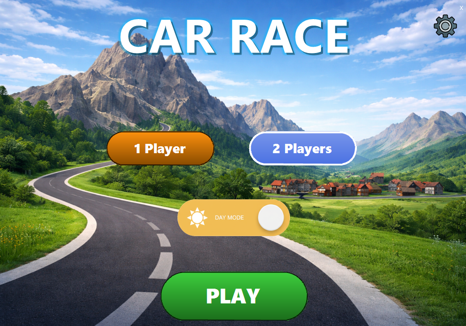

Advanced configuration options are available via the **gear icon** in the top-right corner of the launcher. These include surface physics, sound, fog, automatic car reset, checkpoints, and developer mode.

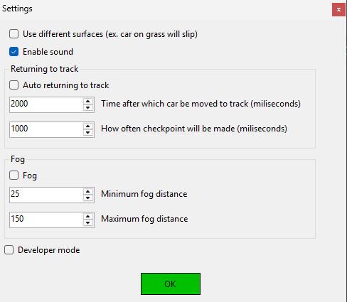

Press **F1** during gameplay to display the help window with current control mappings.


### Default Controls (Player 1)

- **Arrow Up / Down** - Accelerate / Brake  
- **Arrow Left / Right** - Steering  
- **Space** - Handbrake  
- **M / N** - Gear up / Gear down  
- **B** - Return car to last checkpoint  
- **9** - Change camera  
- **, / .** - Look left / right (first-person camera)

The gearbox includes gears **1-5**, **Neutral (N)**, and **Reverse (R)** with realistic gear change behavior.

During gameplay, the HUD displays a **minimap**, **speedometer**, **RPM gauge**, **gear indicator**, and **race time**.

A **Developer Mode** is available (toggle with **F2**), providing debugging windows, real-time parameter changes, and a free camera controlled with **W, A, S, D**.

### Configuration Files

Keybindings can be modified in:  
`assets/settings/keybindings.json`

General game settings are stored in:  
`assets/settings/settings.json`


## Demo

Driving across a bridge with physics-enabled environment interaction.  
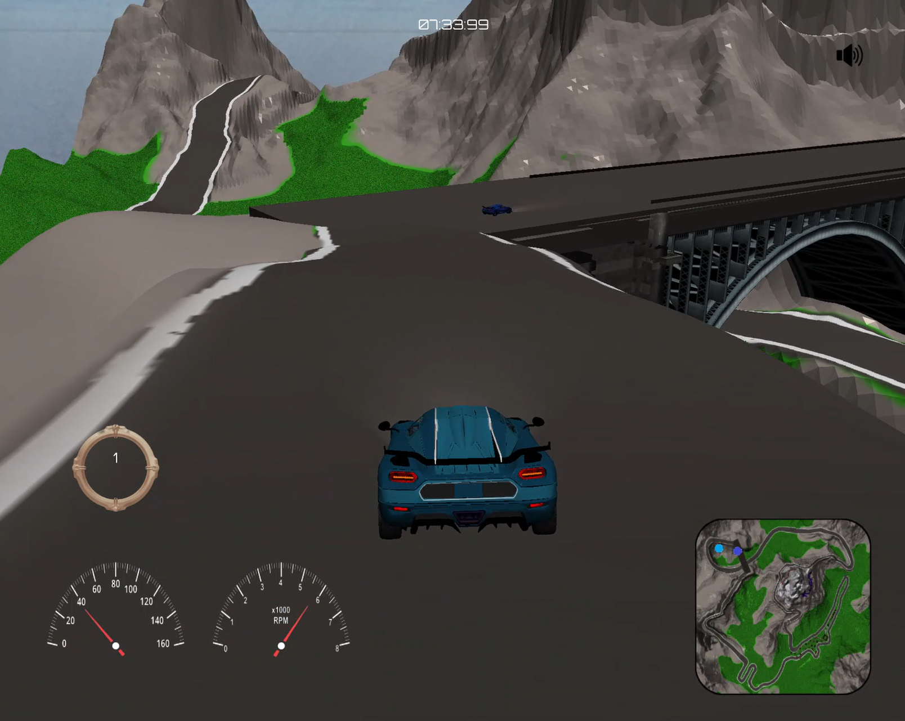

Vehicle collision demonstrating real-time physics response.  
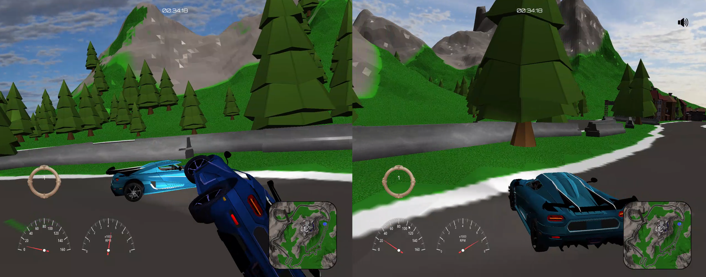

Racing through a city environment with dynamic lighting.  
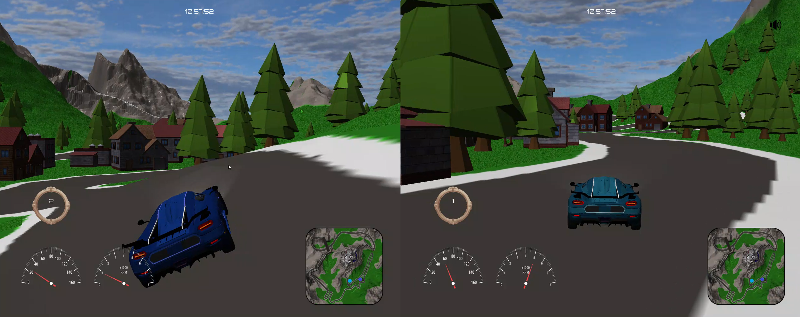

Race start countdown displayed before the beginning of the event.  
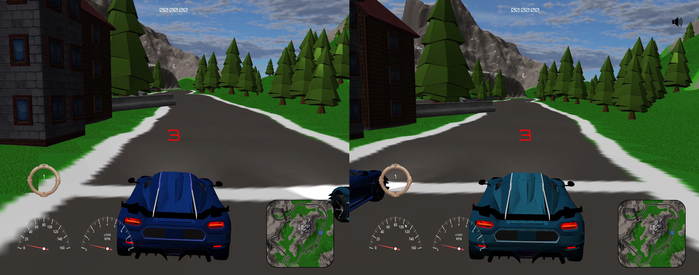

Fog effect demonstrating atmospheric rendering and depth visibility.  
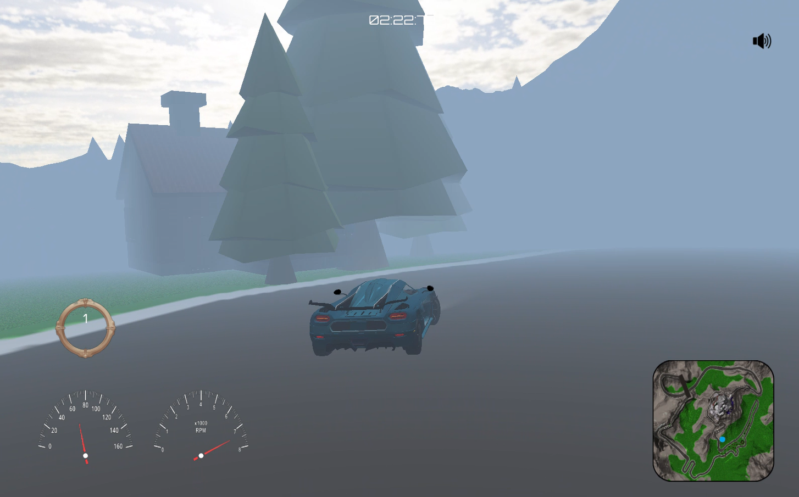

Vehicle jump caused by uneven terrain geometry.  
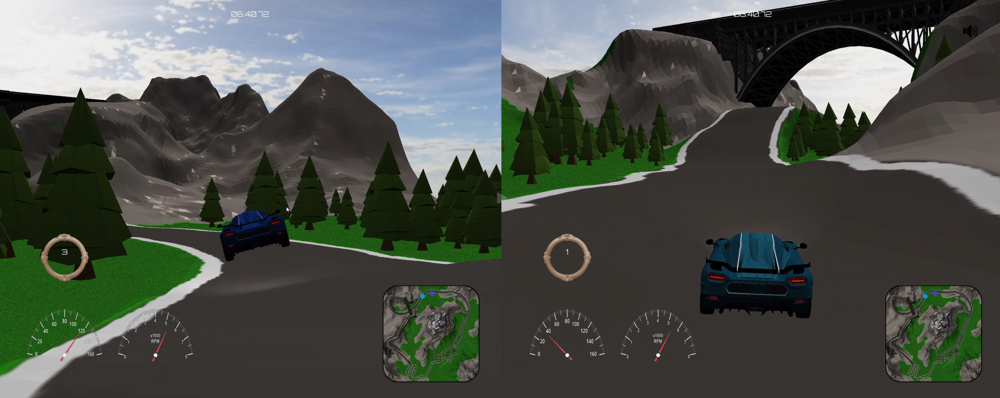

First-person camera view from inside the vehicle.  


Nighttime scene showcasing dynamic lighting and skybox rendering.  
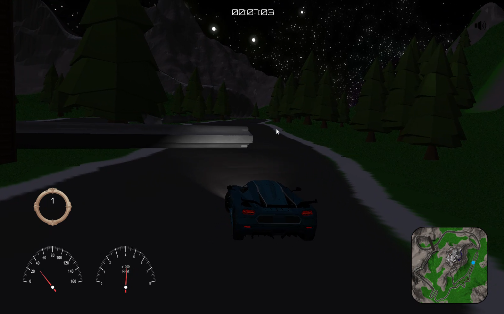

Split-screen view showing two vehicles during local multiplayer gameplay.  
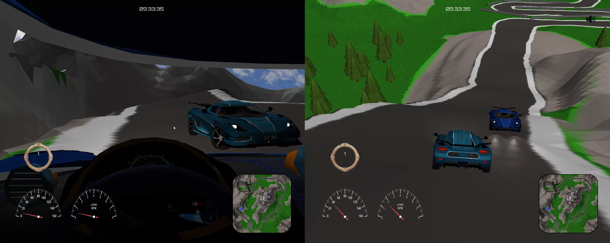

